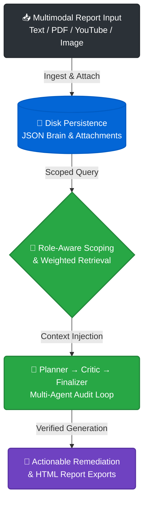

# OmniBrain E.R.I.S. 🌍

**Environmental Report Intelligence System | Agentic Remediation & Governance**

OmniBrain E.R.I.S. (Environmental Report Intelligence System) is an autonomous multi-agent platform designed to log, audit, and remediate environmental hazards. Built with a robust 4-step Planner-Critic-Finalizer pipeline, it features granular role-based access control, multimodal evidence attachments, and project-specific report exports.

🚀 **[Live Demo: Try OmniBrain E.R.I.S. Here](https://omnibrainweb.streamlit.app/)**

---

## ✨ Hackathon Bounties Implemented

* 📎 **Core Bounty — Evidence Attachments:** Seamlessly attach supporting files or images to any environmental report, with local disk persistence and safe inline preview displays.
* 🛡️ **Advanced Bounty — Role-Aware Filtering:** Granular scoping across 6 distinct roles (`User`, `Admin`, `Authority`, `Hospital`, `Investigator`, `Reviewer`) with dynamic list results and visible counts.
* 📄 **Elite Bounty — Project-Specific Exports:** Instant compilation and download of professional HTML incident reports bundling statuses, agent recommendations, field notes, and extracted tags.

---

## 🚀 Key Features

* **Multimodal Ingestion Pipeline:** Natively parses unstructured text, massive PDF reports, YouTube field footage transcripts, and web sources.
* **Autonomous Multi-Agent Loop (Planner → Critic → Finalizer):** Prevents hallucinations by forcing the LLM to cross-examine plans against source records and cite specific evidence sources.
* **Perception & Governance Gates:** Autonomous monitoring agents scan incoming reports for urgent deadlines and trigger interactive approval gates.
* **Resilient LLM Routing:** Built-in dynamic fallback cycling across Google Gemini endpoints to ensure 100% uptime.

---

## 🛠️ Architecture & Tech Stack

* **Frontend:** Streamlit (Custom Dark Theme UI)
* **LLM Engine:** Google Generative AI SDK (`google-genai`)
* **Document Processing:** `pypdf`, `trafilatura`
* **Video Processing:** `youtube-transcript-api`
* **Storage:** Zero-Dependency Local JSON Persistence & Local Attachment Directory

---

### 🔀 System Architecture Flow



---

## 💻 Local Setup & Installation

To run this project locally, follow these steps:

### 1. Clone the repository

```bash
git clone https://github.com/AJ-OmniMatrix/OmniBrain.git
cd OmniBrain

```

### 2. Install dependencies

```bash
pip install -r requirements.txt

```

### 3. Configure API Key

Create a `.streamlit/secrets.toml` file in your root directory:

```toml
GEMINI_API_KEY = "Your_Gemini_API_Key_Here"

```

### 4. Seed Demo Data & Run

```bash
python seed_demo.py
streamlit run app.py

```
